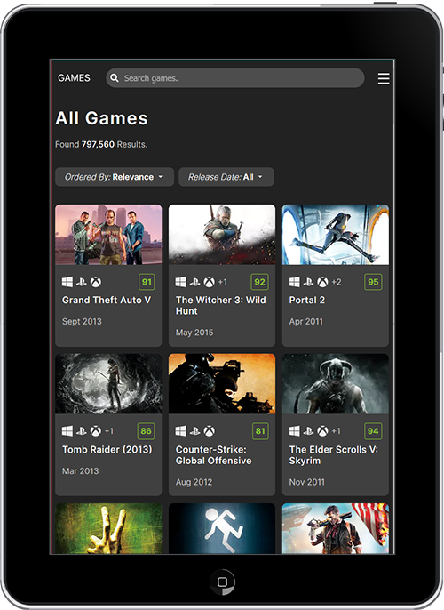

# Games

Explore over 500,000 games across 50+ platforms with this fast, responsive app built using React and Next.js. Powered by the RAWG API, it delivers rich content including trailers, screenshots, descriptions, genres, ESRB ratings, Metacritic scores, and more.

## Design

This project is a reimagined take on the rawg.io platform. It introduces a clean layout, simplified navigation, light and dark theme toggle, and compartmentalised content areas for better focus and breathing space. The goal was to reduce clutter and enhance the browsing experience.

## Features

- Responsive layout and image handling
- Infinite scroll or pagination based on context
- Toggleable mobile navigation
- Modal views for screenshots and trailers
- Light or dark theme
- Custom SVG icons
- Full search functionality
- Dynamic routing and content filtering
- Server-side rendering with Next.js

### Browsable Content

#### Games

- Game cards include: cover image, Metacritic score, platform icons, name, release date
- Game detail pages include: background art, trailer, full description, ESRB rating, developer/publisher info, stats, platforms, genres, tags, stores, series info, achievements, and screenshots

#### Categories

- Browse by: Genres, Tags, Developers, Publishers, Stores
- Platform support includes: PC, PlayStation, Nintendo, Xbox, macOS, Linux, iOS, Android, Amiga, Sega, Atari, Neo Geo, 3DO, Web

#### Filters and Sorting

- Filter by release date or genre
- Sort by relevance, name, release date, or top rated
- Sort: relevance, name, release date, top rated
- Results include counts and scroll or paginate options for usability

## Project Focus

This project allowed me to explore working with server-side rendering in Next.js while building a scalable layout for large datasets. I also implemented dynamic theming, worked extensively with filtered routes and query parameters, and fine-tuned performance when working with external API data and image-heavy content.

## Core Technologies

- HTML5
- Sass(Scss)
- JavaScript (ES6+)
- React
- Next.js (Server-side rendering)

## APIs

- [RAWG](https://rawg.io/apidocs)
- Native Fetch
- Local storage
- Intersection Observer API

## Third party

- React icons

## Design tools

- Adobe Photoshop
- Adobe Illustrator

## Live Site

[Games](https://games-inky-seven.vercel.app)
